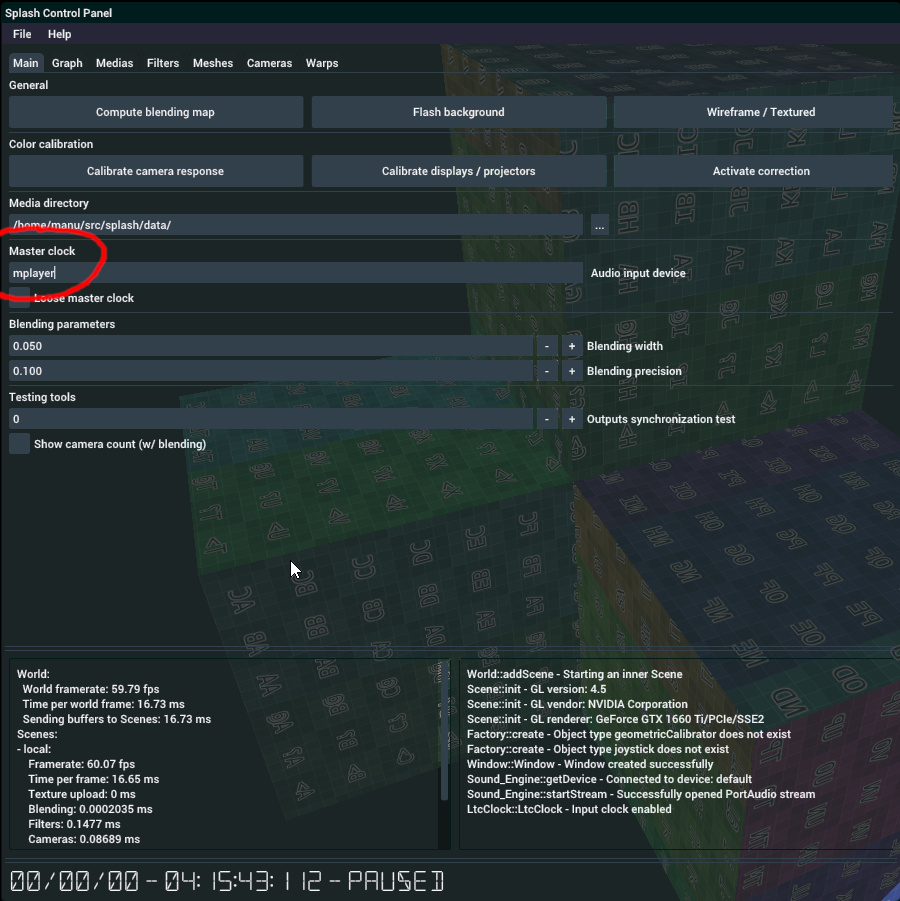
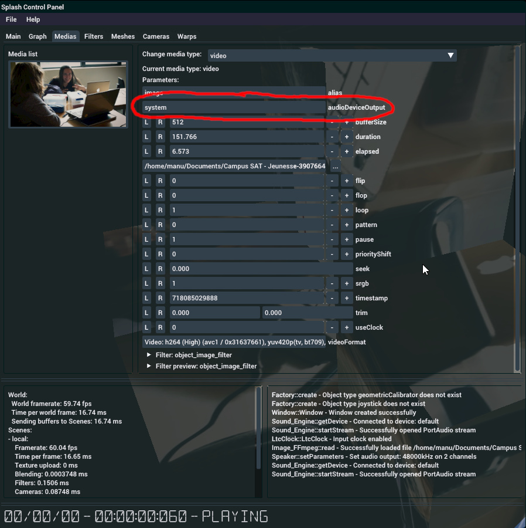
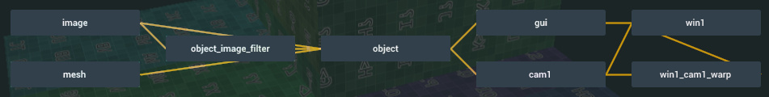
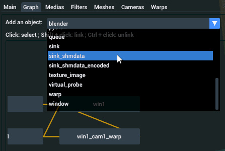
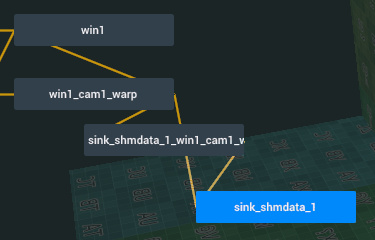
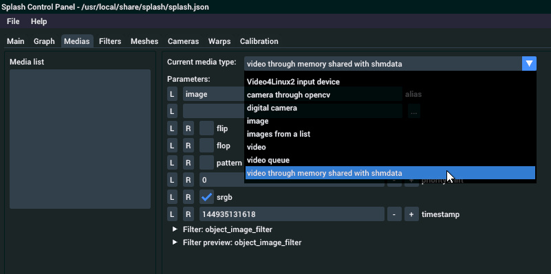
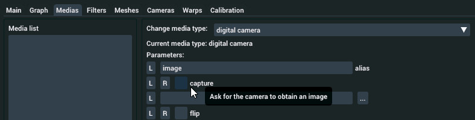

Advanced usages
===============

This section provides information about more advanced usages of Splash, which go beyond a simple installation of a computer connected to a few videoprojectors and reading a video file or an input from a capture card.

- [Python scripting](#python-scripting)
- [SMPTE master clock](#smpte-master-clock)
- [GLSL filter shaders](#glsl-filter-shaders)
- [Piping video into Splash](#piping-video-through-v4l2loopback-or-shmdata)
- [Grabbing rendered images out of Splash](#grabbing-rendered-images-out-of-splash)
- [Using with NDI network streams](#using-with-ndi-network-streams)
- [Using digital cameras as image source](#using-digital-cameras-as-image-source)


-----------------------------------------------

## Python scripting

Splash has the ability to be scripted using Python. It allows for the same level of control as the GUI, meaning that all objects types can be modified, created and deleted, except for Scenes due to a current internal limitation. This can be used for adding any kind of control to Splash: a new GUI, a HTTP, Websocket or OSC server, some automation...

You can specify a script for Splash to run from the command line. Any argument after the `--` will be sent to the script as parameters:

```bash
splash -P script.py config.json -- --pyArg1 value --pyArg2 ...
```

The script can define three different callbacks:
- splash_init(): called once, initializes the script
- splash_loop(): called at each frame
- splash_stop(): called once, terminates the script

Two examples are included with Splash sources, in the `addons/python` subdirectory: `httpServer.py` and `repl.py`. The second one is of particular interest as it creates a Python console which can be queried at runtime like any other Python console. Load it with Splash, and type the following command to have more information about the Python Splash API:

```python
help(splash)
```


-----------------------------------------------

### Attributes callbacks

It is possible to set callbacks on Splash objects attributes, which are called whenever the value of this attribute is changed. This is done through two methods: `splash.register_attribute_callback` and `splash.unregister_attribute_callback`. The following script gives a glimpse at how to use them:

```python
def callback(object, attribute):
    print("Modified attribute {} of object {}".format(attribute, object))

# Set the callback and get its id, for the attribute "flip" of object "image"
attribute_id = splash.register_attribute_callback("image", "flip", callback)

# Modify the "flip" attribute of the "image" object. You should see the following:
# Modified attribute flip of object image

# Unregister the attribute
splash.unregister_attribute_callback(attribute_id)
```


-----------------------------------------------

## GLSL filter shaders

__WORK IN PROGRESS__

Things to know:
* uniforms are automatically added as an attribute to the Filter object
* ... except when the name starts with an underscore
* default uniforms are:
    * texture samplers: _tex0, _tex1, ...
    * texture size: _tex0_size, _tex1_size, ...
    * time since epoch: _time

Here is a quick example, to be improved:

```glsl
#version 450 core

in vec2 tc;
out vec4 fc;

uniform float _time;
uniform vec2 vector = vec2(0.0, 1.0);

void main(void)
{
    fc = vec4(sin(_time / 1000.f), vector.x, cos(_time / 1543.f), 1.0);
}
```


-----------------------------------------------

## SMPTE master clock

Playback rate can be controlled through a master clock, following the [LTC encoding](https://en.wikipedia.org/wiki/Linear_timecode). The timecode is received through an audio input, which by default is the default audio input of the computer (basically, the line in or the microphone input). The timecode is an audio file which can be generated by a number of softwares, among which [Ardour](https://ardour.org/) and the command line utility [ltcgen](https://github.com/x42/libltc).

Using ltcgen (installed from the sources or from a package), one can create an audio file containing the timecode with the following comand:

```bash
# Generate a 1 minute timecode
ltcgen -t 00:00 -l 00:01:00:00 /tmp/timecode.wav
```

This timecode can be played from another computer which output is connected to the input of the Splash computer. It can also be played locally using the Jack audio server. Ensure that Jack and mplayer are installed:

```bash
sudo apt install jackd mplayer
```

The following commands will run the jackd server, and run mplayer with the previously generated audio file:

```bash
jackd -R -d alsa &
mplayer -ao jack:name=mplayer /tmp/timecode.wav -loop 0
```

Lastly, Splash must be set to read the timecode from Jack instead of the default audio input. To do so, you have to set the `Audio input device` option from the `Main` GUI tabulation, and set it to `mplayer` (which is the name we give to the Jack source in the previous command line).



Splash should now receive the timecode from mplayer. As a command line tool, mplayer can be paused with the space bar, and seeked with the arrow keys. In Splash, the current time code can be seen in the `Timings` panel of the GUI.

To terminate the Jack server, type the following command:

```bash
killall jackd
```


-----------------------------------------------

## Set output audio device for videos

Splash has the capability of reading the audio from video files, even though it is usually read from another software/computer and synchronized with Splash through an SMPTE clock (see previous section). This is done individually for each video media, which can give rise to interesting setups using multiple audio output devices.

In the `Medias` GUI tabulation, given that the selected media is of type `video`, there will be an attribute named `audioDeviceOutput` which can be set to the name of any audio output device. As Splash uses [PortAudio](http://portaudio.com/) it can access devices through a lot of API, i.e. PulseAudio or Jack.



For Jack a list of the available devices is available through the following command:

```bash
jack_lsp
```


-----------------------------------------------

## Piping video through v4l2loopback or shmdata

It may happen that the capture card does not comply with the Video4Linux2 API. For example, Blackmagic distributes proprietary drivers with their capture card. As such they are not compatible with Splash out of the box, but it is still possible to use them. The trick is to transmit the data through [v4l2loopback](https://github.com/umlaeute/v4l2loopback) or [shmdata](https://gitlab.com/sat-mtl/tools/shmdata), and read the capture card from [FFmpeg](https://ffmpeg.org) or [GStreamer](https://gstreamer.freedesktop.org/).


### Piping through v4l2loopback

The goal of v4l2loopback is to simulate a V4L2 device (simular to a webcam or a capture card), which is feed from a software. First, you have to install and load it onto your computer. On Ubuntu:

```bash
sudo apt install v4l2loopback-utils
sudo modprobe v4l2loopback
```

A new device should have appeared as `/dev/videoX`, `X` being the id of the device. Let's say you have no other V4L2 device, the path would then be `/dev/video0`.

Then you can launch a GStreamer pipeline (provided that it is installed, which is outside of the scope of this documentation), and feed the device a test stream or the stream from a Blackmagic capture card:

```bash
# Test stream
gst-launch-1.0 -v videotestsrc ! v4l2sink device=/dev/video0

# Capture from a Blackmagic card
gst-launch-1.0 -v decklinkvideosrc ! v4l2sink device=/dev/video0
```

Then in Splash you can create a V4L2 media and grab the feed from the `/dev/video0` device


### Piping through shmdata

Shmdata is a library which gives abilities similar to Syphon on OSX, but more general as it can carry any kind of data. First you have to make sure that it is installed on your system and that Splash has been compiled against it. Grab it [here](https://gitlab.com/sat-mtl/tools/shmdata) and follow the [readme](https://gitlab.com/sat-metalab/shmdata/tree/master/README.md) to compile and install it. Then recompile and install Splash as described on the [Installation](../Installation) page.

You can then launch a GStreamer pipeline and send any feed through Shmdata:

```bash
# Test stream
gst-launch-1.0 -v videotestsrc ! shmdatasink socket-path=/tmp/gst-feed

# Capture from a Blackmagic card
gst-launch-1.0 -v decklinkvideosrc ! shmdatasink socket-path=/tmp/gst-feed
```

Then in Splash you can create a 'video through shared memory' object and set `/tmp/gst-feed` as the filed path. The video feed should display instantaneously.


-----------------------------------------------

## Grabbing rendered images out of Splash

Splash makes it possible to grab the rendered images (from Cameras, Filters, Warps, etc.) and either use it internally (in a Python script for instance) or send it to another software through [shmdata](https://gitlab.com/sat-mtl/tools/shmdata).

There are currently three types of Sinks, which work the same way but have different options:

- Sink, which gives access to the rendered images internally. It can be used in Python using the class of the same name
- SinkShmdata, which allows for sending a rendered image to a shmdata shared memory
- SinkShmdataEncoded, which also sends the rendered image to a shmdata shared memory, but compresses the image beforehand either using the h264 or h265 video compression codec.

To use a Sink, you have to connect it to an object which derives from Texture. A Filter is added automatically as an intermediate object, as it allows for resizing and doing some adjustments on the image before sending.

To illustrate how to use the Sinks, we will start from a default configuration. You should have a configuration graph looking like this (in the Graph tabulation):



Let's say that we want to send the warped output of a Camera to another software. The object we need to connect to is the Warp named "win1_cam1_warp". First we create a new Sink object, for example a SinkShmdata, and we connect it to the Warp (select the warp, the shift+left click on the new Filter).





Once this is done, all you have to do is to activate the Sink by setting the 'opened' attribute to 1. By then you can test that the data flows out of Splash by using the `sdflow` shmdata utility:

```bash
sdflow /tmp/splash_sink
```

You should see frames information printed onto the screen, as well as the caps for the data (mentioning the image size, color space, etc.). If so, the shared memory is ready to be used by another software supporting shmdata!

Do not hesitate to play with the other parameters, in particular the framerate and the bitrate (for the SinkShmdataEncoded object). Also not that by default the size of the image sent is the size of the input image (the Warp in our case). You can resize the image using the Filter object.

Lastly, the internal rendering of Splash is done in a linear color space, which means that the image output from the Sink will also be linearly encoded. You will have to convert it to sRGB on the receiving software for the image to be displayed correctly on a sRGB display.


-----------------------------------------------

## Using with NDI network streams

[NDI](https://ndi.tv/) stands for Network Device Interface, and is "a royalty-free software standard (...) to enable video-compatible products to communicate, deliver and receive high-definition video over a computer network (...)" (definition from [Wikipedia](https://en.wikipedia.org/wiki/Network_Device_Interface)). Despite being royalty-free, NDI is not compatible with the GPL license of Splash but it can be used with it nonetheless.

A separate tool has been developed to convert NDI audio/video streams to and from shmdata, the shared memory protocol supported natively by Splash. Subtly named `ndi2shmdata`, this tool can be installed like this:
```bash
git clone https://gitlab.com/sat-mtl/tools/ndi2shmdata
cd ndi2shmdata
mkdir build && cd build
cmake -DACCEPT_NDI_LICENSE=ON ..
make -j$(nproc) && sudo make install
```

Once built and installed, `ndi2shmdata` can list the streams available over the local network:
```bash
ndi2shmdata -l
```

If a stream is accessible, it should show something like this:
```bash
SATMETA-0096 (stream)
```

This is basically the computer name (in uppercase) and the stream name between parenthesis. The stream can be converted to shmdata like this:
```bash
ndi2shmdata -n 'SATMETA-0096 (stream)' -v /tmp/ndi_stream
```

The first parameter is the whole description of the stream as given by the previous command. The second argument is the path to the shmdata socket corresponding to the video stream. To read the video stream from Splash go to the `Medias` tabulation of the user interface, select the media source which should read the stream and replace its type with `video through memory shared with shmdata`. Then set the path to the previously chosen shmdata socket path, in our case `/tmp/ndi_stream`.



You should now see the video stream in Splash!


-----------------------------------------------

## Using digital cameras as image source

Splash can make use of a digital camera, as long as it is compatible with [gPhoto](http://gphoto.org/). It can be used with the `digital camera` media type or for calibrating the videoprojectors color curves.

First of all, Splash needs to have total control over the digital camera, otherwise it might fail getting and setting parameters, as well as shooting photos. Be sure to set the camera to `manual` mode. It is also advised to set the focus to manual as this will prevent the digital camera to change its focus between shot, which would be deterrent for HDR image capture.

### Use as an image source

To use a digital camera as a media source, just replace the media type in the `Medias` tabulation to `digital camera`. If a camera is connected and not already allocated by another software (this might be the case with some desktop environment which automatically mount cameras), Splash should be able to connect to it and get information from it such as its selected aperture, exposure time, ISO and model name.



As this media type is not live, you will not see anything at first. Click on the `capture` checkbox to trigger a shot which should happen within seconds. Splash should then show the captured image.

### Use for color calibration

Splash makes use of digital cameras for color calibration. The process is as follow:
* calibrate the digital camera to use it as a reliable measurement tool
* calibrate each projector one by one, by displaying successive colors and capturing the resulting projection with the digital camera.

All projectors are calibrated at once so all projections must be in the field of view of the camera. A fisheye lense might be useful when calibrating fully immersive setups.


To calibrate the digital camera, position it towards a well lit scene, preferably static. Then press `Calibrate camera response` in the `Main` tabulation of Splash. It will connect to the first digital camera available and start the calibration.

Once the camera is calibrated, move it so that its field of view encompasses all the projections, and press `Calibrate displays / projectors`. The process can take a long time. Once finished, press `Activate correction` to enable the color correction.
