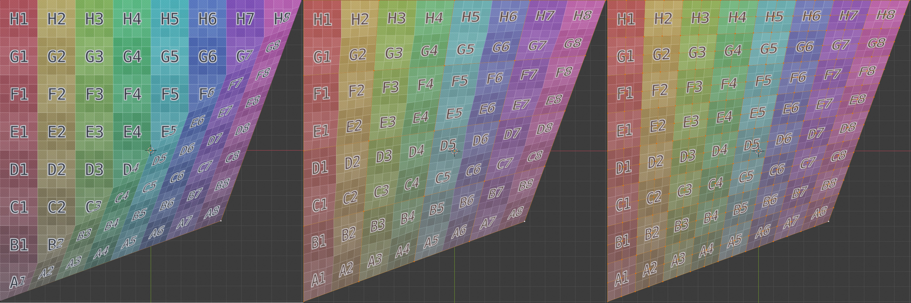

This section lists a few best practices and gotchas regarding Splash and its calibration.

-----------------------------------------------

## Preferred codecs

Splash has been built to handled very large video feeds, but not all video codecs can manage high resolution files correctly. Internally, Splash uses [FFmpeg](http://ffmpeg.org/) to read the video files. The suggested codecs, based on the resolution, are the following:

| Max. resolution  | MJPEG | HapQ | HapAlpha | Hap |
|------------------|-------|------|----------|-----|
| 3072x3072 @ 30Hz |   OK  |  OK  | OK       | OK  |
| 4096x4096 @ 30Hz |       |  OK  | OK       | OK  |
| Anything higher  |       |      | OK       | OK  |

Note that all these codecs have no inter-frame compression. This does not mean that codecs with inter-frame compression can not be read, but the listed codecs have the best performances for very high resolutions videos. Also, codecs with inter-frame compression are not tested and some issues can arise with these.

To convert your existing video files to one of these codecs, it is suggested to use [FFmpeg](https://ffmpeg.org). In the following commands, replace ${INPUT_FILE} and ${OUTPUT_FILE} with the source video file name and the output video file name.

```bash
ffmpeg -i ${INPUT_FILE} -c:v mjpeg -c:a copy ${OUTPUT_FILE}
ffmpeg -i ${INPUT_FILE} -c:v hap -format hap_q -chunks 8 -c:a copy ${OUTPUT_FILE}
ffmpeg -i ${INPUT_FILE} -c:v hap -format hap_alpha -chunks 8 -c:a copy ${OUTPUT_FILE}
ffmpeg -i ${INPUT_FILE} -c:v hap -format hap -chunks 8 -c:a copy ${OUTPUT_FILE}
```

-----------------------------------------------

## Best practices

- Splash is designed with real-world scale in mind: it is strongly advised to use the meter as the unit for the 3D models, to prevent issues with near or far clipping.
- The basis used in Splash is so that the XY plane is horizontal, and the Z axis is vertical. The 3D models should be exported with this basis to prevent navigation issues while calibrating.
- For performance reasons, it is strongly advised to use no more than one window for each graphic card. Each additional window implies some context switching, which degrades performances.


-----------------------------------------------

## Default values file

It is possible to override the hardcoded default values for the various objects by setting up a default values files. Splash looks for such a file based on the `${SPLASH_DEFAULTS}` environment variable, which should point to a Json file with the correct structure. It is ones responsibility to set this environment variable, for example by specifying it right before running Splash:

```bash
export SPLASH_DEFAULTS="${HOME}/.config/splash"
```

In this example, the configuration file should be located in `${HOME}/.config/splash`, and look like this:

```json
{
  "image_ffmpeg" : {
    "bufferSize" : 4096
  }
}
```

Here, the `bufferSize` parameter of the `image_ffmpeg` type (which is responsible for reading videos) is set to 4096MB by default, overriding the hardcoded value of 512MB. Note that the object type may differ from the type shown in the GUI, please refer to the [documentation](../Technical_Information/#software_architecture) to find the correct type.


-----------------------------------------------

## Video overlay

Objects can have multiple images (or videos) linked to them. As of yet there is no blending options, but if the second image has an alpha channel it will be used as a mask to merge the two sources. The alpha channel of the first image is completely discarded.

For still images, it is advised to use the PNG file format. For videos the Hap Alpha codec is the best choice, converted from a sequence of PNG files with transparency. See the [FAQ](#preferred-codecs) for information about how to convert from a PNG sequence to a Hap video file.

To connect an additional image to an object, on the GUI control panel:

* create a new image / image_ffmpeg / image_shmdata
* select the file to play by setting its path in the image attributes
* shift+click on the target object to link the image to it


-----------------------------------------------

## Troubleshooting

### Installation

- _Compilation fails although I have followed closely the build instructions_: the most obvious reason is that you did not install the OpenGL drivers for your graphic card. You can do it with the following commands:
    - Nvidia graphic card:

        ```bash
        sudo apt install nvidia-cuda-toolkit
        ```

    - AMD or Intel card: 

        ```bash
        sudo apt-add-repository ppa:oibaf/graphics-drivers
        sudo apt update
        sudo apt install mesa
        ``` 

- _Blender addon returns an error on activation_: if the error is related to the `multiarray` class of `numpy`, the issue is due to a discrepancy between the installed `numpy` module and the version of the Python interpreter bundled in Blender. A way to fix it is to install `numpy` for the correct Python version in the user space.

    For example if Blender has been linked against Python 3.7 (which is the case when writing these lines), on Ubuntu:

    ```bash
    sudo apt install python3.7
    python3.7 -m pip --user numpy
    ```

    You should now be able to activate the addon correctly.

### Crash
- _Splash closes at startup with the following message_:

    ```bash
    splash: pcm.c:2757: snd_pcm_area_copy: Assertion `src < dst || src >= dst + bytes' failed.
    Aborted (core dumped)
    ```

  _Solution_:
  This issue is related to a bug in Alsa / PulseAudio. It can be solved simply by updated your system.

### Usage

- _I launch Splash and I cannot see any GUI_: the GUI is hidden by default, the shortcut to show it is __ctrl+Tab__. Note that if no specific GUI window has been set, the GUI will be accessible from the first window created.
- _I cannot see any image on my 3D model_: for the image to be projected correctly, the 3D model needs to have some texture coordinates set (also known as UV coordinates). The texture coordinates can be added from the 3D modeling software you used to create the model (i.e. Blender).
- _I can load images, but I get errors when I load videos_: be sure to change the media type to `video` before trying to load a video. This can be done in the Media panel.
- _Splash keeps complaining about 'No protocol specified', and GLFW is unable to initialize'_: if you are on Ubuntu 17.10, Wayland is running alongside Xorg when using a window manager which does not support Wayland. You need to force the display server ID, using the -S option of Splash (see ```splash --help```)

### 3D models

- _The texture coordinates do not match the planar surface I'm projecting onto, despite the corners being placed correctly_: this happens when the original 3D model for this surface is a quad. Due to its internal working, Splash converts quads to triangles automatically. This process can lead in some cases to deformations of the texture coordinates. For now the easiest way to fix this is to subdivide the 3D model prior to exporting it for Splash. Note that this behavior can also be seen in the 3D modeler.


