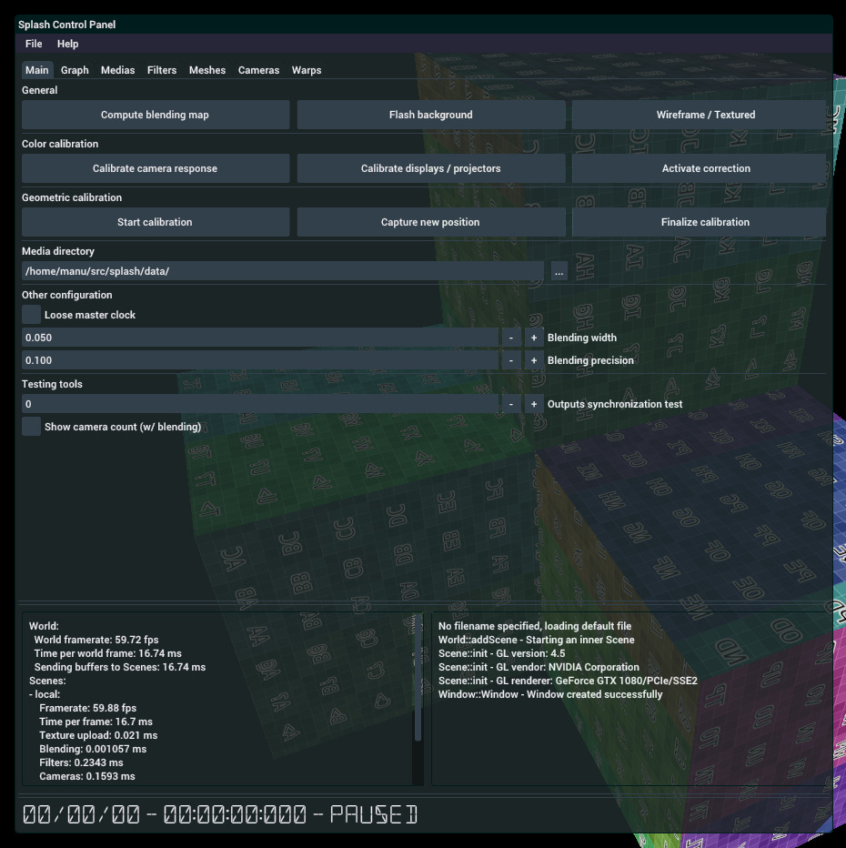
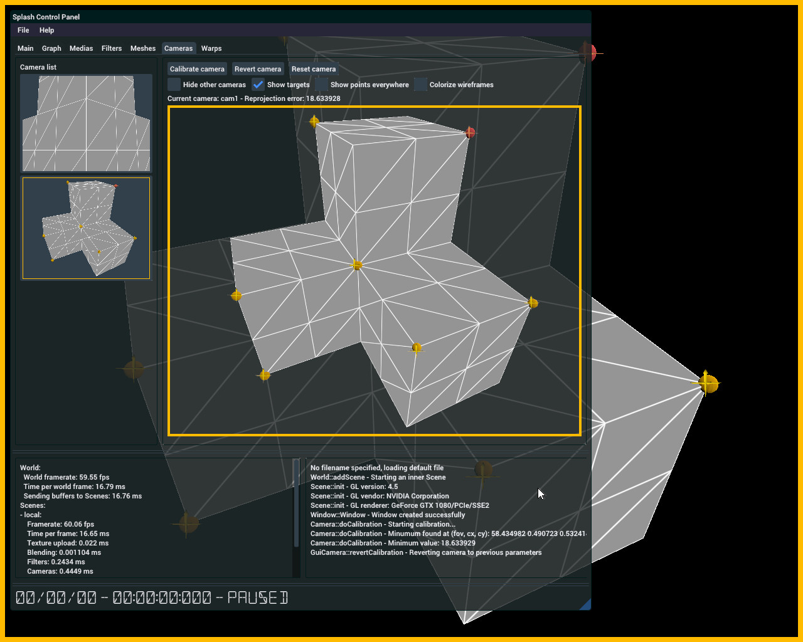
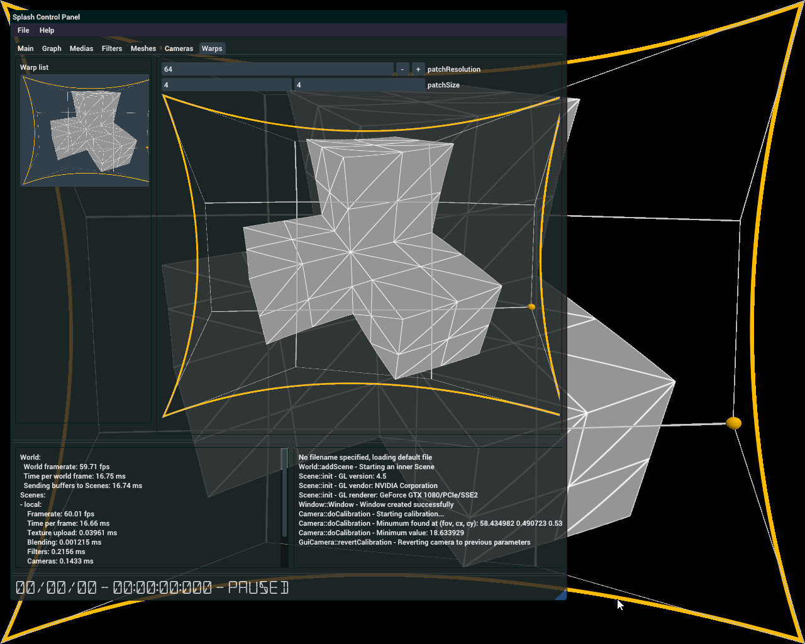
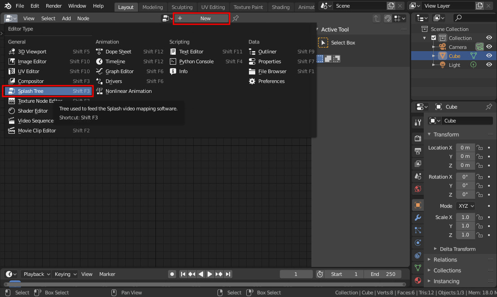
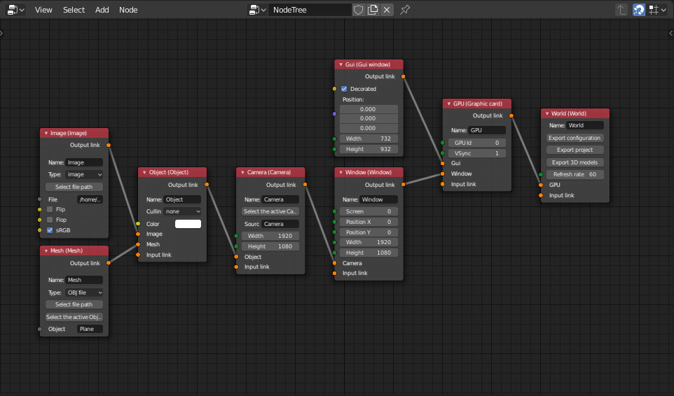
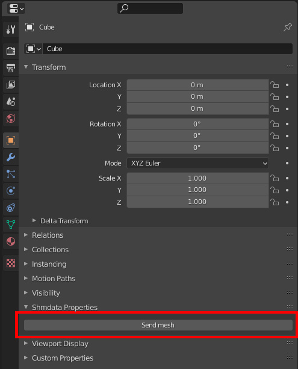
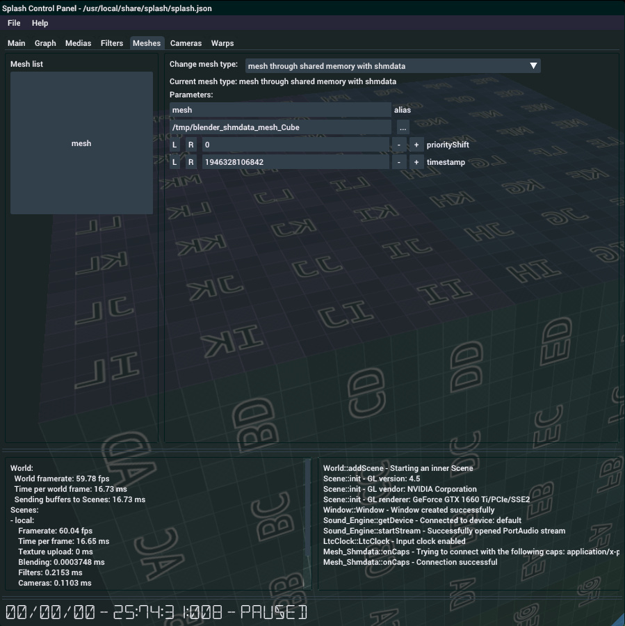

User interface
==============

## Graphical user interface

The GUI appears in the very first Window created (this means that if you prefer having the GUI in its own window, you can specify the first window as empty, i.e. no link to anything, this can be very handy). Once Splash is launched, the GUI appears by pressing Ctrl + Tab. The Splash Control Panel is divided in tabulations, as follows:



- Main: contains very generic commands, like computing the blending map
- Graph: shows the scene graph and allows for controlling the parameters of every object,
- Medias: allows for changing input files,
- Filters: shows all image filters, useful when multiple filters are used in cascade on a single input media,
- Meshes: allows for changing 3D models,
- Cameras: shows a global view of the projection surface, which can be switched to any of the configured Cameras. This tabulation is also used to set geometric calibration up,
- Warps: this is where projection warping is modified, in these cases where the projection surface is not perfectly reproduced by the 3D model.

At the bottom of the GUI you will find performance counters, the logs as well as the current master clock.

## Calibration

### Geometrical calibration

This is a (very) preliminary guide to projector calibration in Splash, feel free to report any error or useful addition.

The way calibration works in Splash is to reproduce as closely as possible the parameters of the physical projectors onto a virtual camera. This includes its intrinsic parameters (field of view, shifts) as well as its extrinsic parameters (position and orientation). Roughly, to find these parameters we will set a few point - pixel pairs (at least six of them) and then ask Splash to find values which minimizes the squared sum of the differences between point projections and the associated pixel position.

Once the configuration file is set and each videoprojector has an output, do the following on the screen which has the GUI:

- Press Ctrl + 'Tab' to make the GUI appear,
- open the Cameras tabulation
- select the camera to calibrate by clicking in the camera list on the left,
- press Ctrl + 'W' to switch the view to wireframe,
- left click on a vertex to select it,
- Shift + left click to specify the position where this vertex should be projected. You can move this projection with the arrow keys,
- to delete an erroneous point, Ctrl + left click on it,
- continue until you have seven pairs of point - projection. You can orientate the view with the mouse (right click + drag) and zoom in / out with the wheel,
- press 'C' to ask for calibration.



At this point, you should have a first calibration. Pressing 'C' multiple times can help getting a better one, as is adding more pairs of points - projection. You can go back to previous calibration by pressing Ctrl + 'Z' (still while hovering the camera view).

Once you are happy with the result, you can go back to textured rendering by pressing Ctrl + 'T' and save the configuration by pressing Ctrl + 'S'. It is advised to save after each calibrated camera (you never know...). Also, be aware that the calibration points are saved, so you will be able to update them after reloading the project. They are not dependent of the 3D model, so you can for example calibrate with a simple model, then change it for a high resolution model of the projection surface.

### Projection warping

For these cases where you 3D model does not exactly match the projection surface (lack of proper physical measures, inflatable dome, plans do not match the real surface...), you can use projection warping to correct these last few spots where the projectors do not match. It is meant to be used as a last resort tool, as it will by definition produce a deformed output.

Projection warping allows for projection deformation according to a set of control points, from which a Bezier patch is computed. The result is a continuous deformation which can help making two projections match.

The user interface to control warping is similar to the camera calibration interface:

- Press Ctrl + 'Tab' to open the GUI,
- open the Warps tabulation,
- select the projection you want to warp by clicking in the projection list on the left,
- a grid appears on the desired projection: while still in the GUI, you can move the control points (the vertices of the grid),
- when satisfied, close the Warps tabulation to make the grid disappear.



### Color calibration

__Note__: color calibration is still experimental

Color calibration is done by capturing (automatically) a bunch of photographs of the projected surface, so as to compute a common color and luminance space for all the videoprojectors. Note that Splash must have been compiled with GPhoto support for color calibration to be available. Also, color calibration does not need any geometric calibration to be done yet, although it would not make much sense to have color calibration without geometric calibration.

- Connect a PTP-compatible camera to the computer. The list of compatible cameras can be found [there](http://gphoto.org/proj/libgphoto2/support.php).
- Set the camera in manual mode, chose sensitivity (the lower the better regarding noise) and the aperture (between 1/5.6 and 1/8 to reduce vignetting).
- Open the GUI by pressing Ctrl + 'Tab'.
- Go to the Graph tabulation, find the "colorCalibrator" object in the list.
- Set the various options, default values are a good start:
    - colorSamples is the number of samples taken for each channel of each projector,
    - detectionThresholdFactor has an effect on the detection of the position of each projector,
    - equalizeMethod gives the choice between various color balance equalization methods:
        - 0: select a mean color balance of all projectors base balance,
        - 1: select the color balance of the weakest projector,
        - 2: select the color balance which would give the highest global luminance,
    - imagePerHDR sets the number of shots to create the HDR images on which color values will be measured,
    - hdrStep sets the stops between two shots to create an HDR image.
- Press Ctrl + 'O' or click on "Calibrate camera response" in the Main tabulation, to calibrate the camera color response,
- Press Ctrl + 'P' or click on "Calibrate displays / projectors" to launch the projector calibration.

Once done, calibration is automatically activated. It can be turned off by pressing Ctrl + 'L' or by clicking on "Activate correction". If the process went well, the luminance and color balance of the projectors should match more closely. If not, there are a few things to play with:

- Projector detection could have gone wrong. Check in the logs (in the console) that the detected positions make sense. If not, increase or decrease the detectionThresholdFactor and retry.
- The dynamic range of the projectors could be too wide. If so you would notice in the logs that there seem to be a maximum clamping value in the HDR measurements. If so, increase the imagePerHDR value.

While playing with the values, do not hesitate to lower the colorSamples to reduce the calibration time. Once everything seems to run, increase it again to do the final calibration.

Also, do not forget to save the calibration once you are happy with the results!

### Blending

The blending algorithm uses vertex attributes to store the blending attributes. An OpenGL context version of at least 4.3 activates the vertex blending, otherwise no blending is available.

To activate the blending, and as long as calibration is done correctly, one only has to press Ctrl + 'B'. Pressing Ctrl + Alt + 'B' will recalculate the blending at each frame (meaning that it can handle moving objects!).

Vertex blending has some known issues, most of which can be handled by tweaking the blending parameters of the cameras: blendWidth and blendPrecision. To find the best values, activate blending with Ctrl + Alt + 'B', tune the parameters, and check the result.


## Blender addons

### Export configuration from Blender

Once Splash is compiled, a Blender addon is packaged, ready for installation. This addon allows to:

- create a draft scene (textured objects + cameras) and export them as a Splash configuration file,
- send in real-time, through shmdata, meshes and textures from Blender to Splash.

To install it, download it from [there](../blender_splash_addon.tar.bz2). Open the Blender User Preferences window, select the "Add-ons" panel, then "Install from File...". Navigate to the download directory and select `blender_splash_addon.tar.bz2`. Now activate the addon which should appear in the "User" categorie.. It needs a recent version of Blender in order to work (2.80 or newer).

Note also that you need to have the Numpy Python module to be installed.

The addon adds a new type of trees accessible through the "Splash Tree" editor type. There, one can create from scratch a new configuration by linking nodes which hold the same parameters as their Splash counterparts. To add a new tree click on "New".



To add a node, press Shift + A or use the tool shelf. Only the most useful objects are available in this addon. Basically, it is meant to give access to any kind of configuration, but not to some alternative uses of Splash. The following nodes are available (see the Software architecture pages for reference):

- World
- GPU
- Window
- Camera
- Object
- Probe
- Mesh
- Image
- Gui, which is a special Window dedicated to displaying the user interface. It has to be the first node linked to the first Scene of the configuration.

Any configuration has to have one World node, at least one Scene, one Window and one Camera. It also needs one Object, Image and Mesh to have something to project. The simplest (useful) configuration then looks like this:



Once the configuration is complete, the exportation is done through the "Export configuration" button of the World node. Note that there can be multiple Word nodes, allowing for multiple configurations to be held in a single tree. If a Blender mesh has been selected through a Mesh node, it will be exported as an OBJ file. And if a Blender camera has been selected through a Camera node, its parameters (intrinsics and extrinsics) will be used during the export.

You can also export only a part of the configuration, more precisely only data related to images and 3D models, through the "Export project" button of the World node. This allows for changing the projection surface and the projected media, while keeping the calibration. In practice, the user has to load a configuration file, then a project file from the Splash GUI.

Laatly, it is also possible to export only the 3D models through the "Export 3D models" button. This is useful as Splash uses specific OBJ export parameters, and it exports all 3D models at once.

### Send meshes live from Blender to Splash

Another useful addon which can be combined with Splash is the [shmdata addon](https://gitlab.com/sat-metalab/blender-addon-shmdata). Shmdata is a library which allows for sharing memory buffers between software, and the shmdata addon brings this capability to Blender. More specifically it allows for sharing meshes from Blender to Splash, so that the user can modify the projection surface in real-time.

To install it, you need to first need to install the [shmdata library](https://gitlab.com/sat-metalab/shmdata) if it's not already the case. Refer to [shmdata's documentation](https://gitlab.com/sat-metalab/shmdata/-/blob/master/README.md) for this. Then you can install the shmdata Blender addon by following [its documentation](https://gitlab.com/sat-metalab/blender-addon-shmdata).

Once installed in Blender you should see an additionnal section in the `Object properties` when having a 3D object selected: `Shmdata properties`. This section has a single button, `Send mesh`, which will send the current object through the shared memory. Any modification to the 3D mesh is then sent in real-time to any client software connected to the shmdata.



For example when sending the default cube, a shared memory socket will be created in the filesystem with the path `/tmp/blender_shmdata_mesh_Cube`. You can check that frames are sent correctly with the following command:

```bash
sdflow /tmp/blender_shmdata_mesh_Cube
```

You should get something which looks like this when moving the default cube around:
```
connected: type application/x-polymesh
0    size: 896    data: 3F8000003F80000000000006000000...
1    size: 896    data: 3F8000003F80000000000006000000...
2    size: 896    data: 3F80E7C33F80683400000006000000...
3    size: 896    data: 3F80E7C33F80683400000006000000...
4    size: 896    data: 3F8254DC3F8204CE00000006000000...
5    size: 896    data: 3F8254DC3F8204CE00000006000000...
6    size: 896    data: 3F85917A3F8471CF00000006000000...
7    size: 896    data: 3F85917A3F8471CF00000006000000...
```

From there you can connect Splash to the shared memory. In Splash under the `Meshes` tabulation, select a mesh and change its type from `mesh from obj file` to `mesh through shared memory with shmdata` (you might need to recompile Splash with support for shmdata activated). Then type the path to the shared memory socket in the appropriate section. After modifying/moving the default cube around in Splash, it should appear in Splash.


