Walkthrough
===========

This section shows different ways of using Splash through examples. The examples are grouped in two sections: standard and advanced usages. As the names suggest, standard usages relate to easy use cases of Splash, while advanced usages relate to less common and more complexe use cases.

All these examples rely on the Blender exporter, so you need to install [Blender](https://blender.org) as well as the [Splash addon](../User_Interface/#blender_export).

-------------------------------------------

## Standard usages

### Single projector example

This example shows how to project onto a known object for which we have a 3D model. The workflow is as follows:
- create a 3D model of the object which will serve as a projection surface,
- export from Blender a draft configuration file,
- open the file in Splash, calibrate the projector,
- load some contents to play onto the surface.

To do this this tutorial, you will need:
- Splash installed on a computer
- a video-projector connected to the computer
- a box-shaped object

#### Create a 3D model of the object, as well as the draft scene
To keep things simple, the projection surface will be a simple box, or a cube in our case. This makes the creation of the 3D model easy, which is good as it is a bit out of the scope of Splash. Indeed, Splash is dedicated to handling the video-projectors, not creating the 3D model. So creating the model from the dimensions of the real object is an option, [photogrammetry](https://en.wikipedia.org/wiki/Photogrammetry) is another.

So, assuming you know how to use Blender, at this point we have a real object and its virtual counterpart, which looks quite similar geometry-wise. I did not measure the plaster cube, which proved sufficient if not perfect in the following steps.

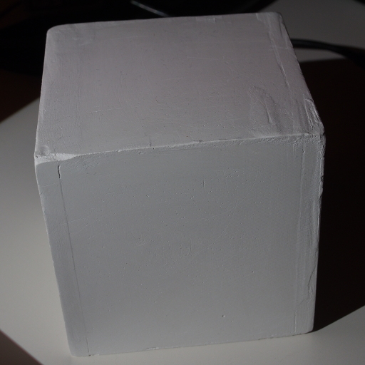 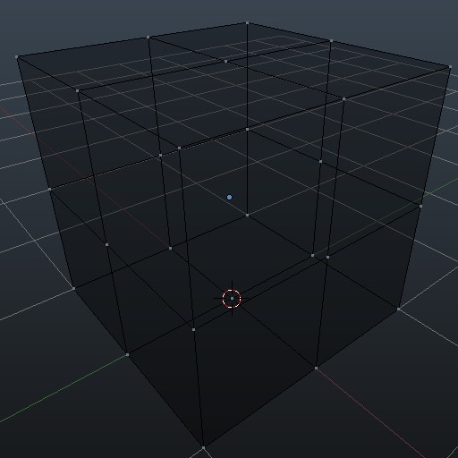

A useful note is that projector calibration needs the user to set at least seven points for each projectors, which means that each projector must see at least seven vertices. So add some vertices (i.e. using subdivision) if your model is a simple cube.

We need some texture coordinates for the projection mapping to happen, you can add them simply by entering Edit mode with the mesh selected (Tab key), press 'U' and select 'Smart UV Project'. Then exit edit mode by pressing Tab again. We will now place a virtual camera (which will translate into a projector in the real world) facing the object.

Lastly, we will create the configuration for Splash. For this example we will consider that there is one screen and one video-projector connected to the computer, the video-projector being the second display with a resolution of 1920x1080. We want to output on the video-projector, but still have a window for the GUI on the first screen. We use the Blender addon to create this configuration, and the Splash node tree we create looks like this:

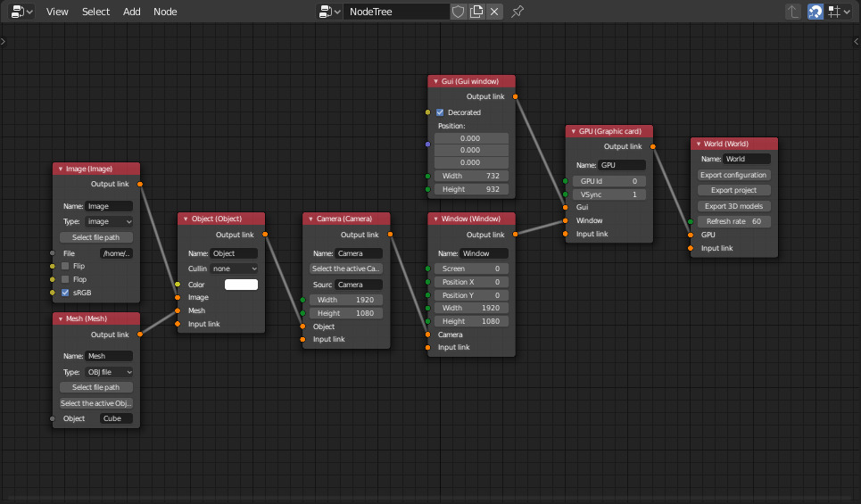

The GUI window is created through a dedicated node, the other window is created through a Window node which is set as fullscreen on the second screen (which has 1 as an index). The Camera holding the video-projector parameters is connected to this Window, and the Object is connected to the Camera. The Mesh node is set to use the data from the Blender object representing a cube, and the Camera is set to use the data from the Blender camera. Lastly, the chosen image for the Image node is the file 'color_map.png' located in the 'data' folder of the Splash sources, as it is very handy for calibrating.

Now we have to click on 'Export configuration' from the World node, which will export all the nodes connected to it. Let's name the output file 'configuration.json'. The Blender object's mesh will be automatically exported in the same directory.


#### Projector calibration inside Splash
Now is the time to run Splash with our newly created configuration file. To do so, either open Splash with a default configuration file (this will be the case on OSX if you launch the application bundle) and drag&drop the new configuration file onto one of the windows ; or launch Splash in command line with the configuration file as a parameter:

``` bash
splash configuration.json
```

Two windows will appear. One is the window you set up previously, appearing on the video-projector and displaying the box, though not calibrated at all. The other window appears blank, but a simple Ctrl + Tab on it will show the GUI, which will be helpful to go forward. You can navigate through the GUI, the important tabulation being 'Cameras'. Open it, and select the camera we set up in Blender (which is subtly named 'Camera'). What is displayed in the 3D view is now exactly what is projected through the video-projector (well, except for the scale).

Now press Ctrl + W: this switches the view to wireframe. Now we will set seven calibration points. This goes as follows, everything being done inside the GUI view:

- select a vertex on the mesh by left clicking it,
- the selected vertex now has a sphere around it, and a cross appeared in the middle of the view,
- move the cross by pressing Shift and left clicking anywhere in the view,
- while looking at the projection onto the real object, place the cross on the point corresponding to the selected vertex,
- you can move the cross more precisely with the arrow keys,
- repeat for the next vertex. If you selected the wrong vertex, you can delete the selection by pressing Ctrl and left clicking the vertex,
- also, you can update a previously set vertex by re-selecting it.

Once you have set seven vertices, you can ask for Splash to calibrate the camera / video-projector: press C while hovering the 3D view. You should now see projected onto the real object the wireframe of its virtual counterpart:

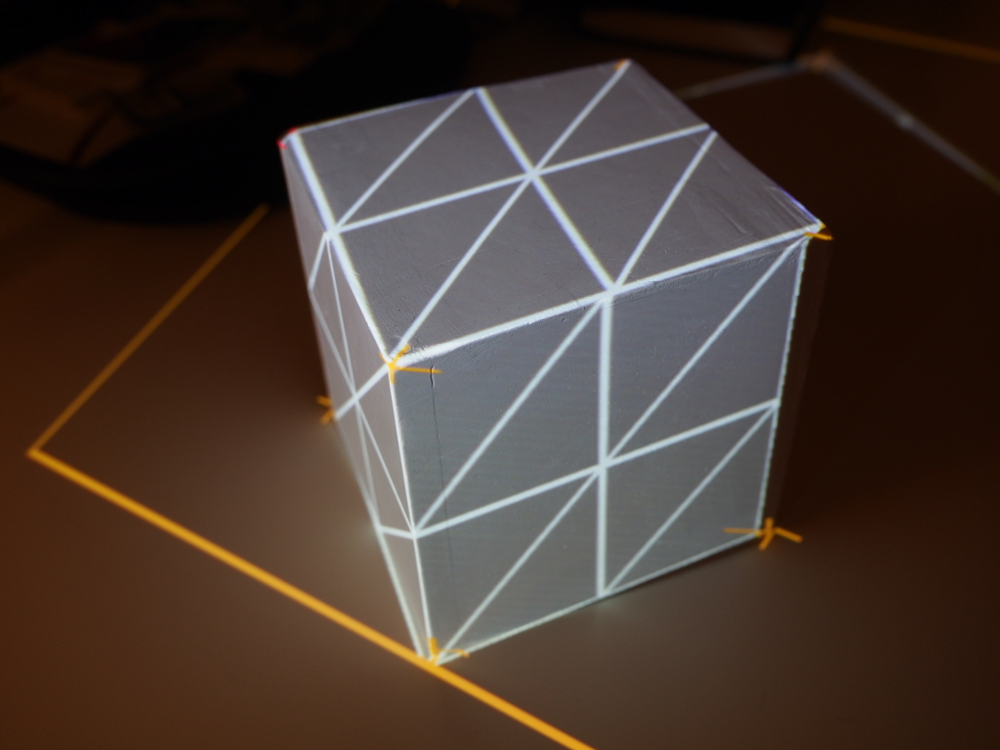

Switch back to textured view with Ctrl + T, and save the result with Ctrl + S. The calibration is done, and we can now set a video to play onto the box!


#### Add some video to play
The final step is to replace the static texture used previously with a film. Still in Splash, go to the Medias tabulation. There you have a list of the inputs of your configuration and you can modify them. Select the only object in the list, that change its type from "image" to "video". Next, update the "file" attribute with the full path to a video file.

And that's it, you should now see the video playing onto the object, according to the UV coordinates created in Blender. Here I set the same coordinates for all faces of the cube, so that the same video is mapped on each one of them.

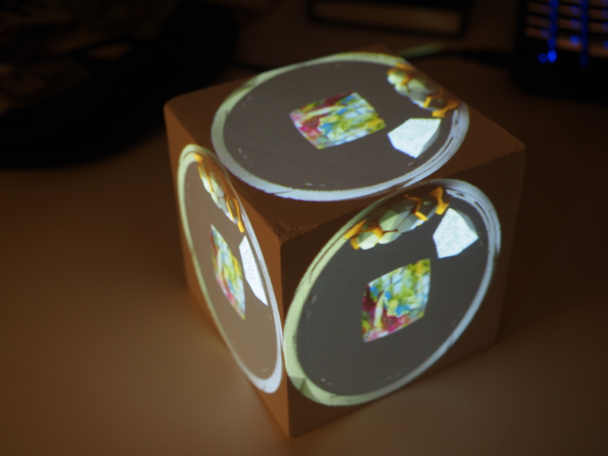

There is a lot more to it, as with this method you can calibrate multiple projectors (virtually unlimited), projecting onto multiple objects. The blending between the projectors is computed automatically by pressing Ctrl + B once the calibration of all the projectors is done. It is also possible to feed Splash with a mesh modified in real-time in Blender, using the Splash panel in the 3D View tool shelf.

-------------------------------------------

### Multi-projector example

This example explains step by step how to calibrate multiple projectors on a relatively simple surface. The projection surface is a tilted dome, projected onto with three video-projectors. The workflow is as follows:
- create a low definition 3D model of the projection surface, used for calibration,
- export from Blender a draft configuration file,
- open the file in Splash, calibrate the video-projectors,
- create a high definition 3D model of the projection surface, used for projection,
- replace the low definition 3D model with the high definition one,
- load some contents to play onto the surface.

To do this this tutorial, you will need:
- Splash installed on a computer
- at least two video-projectors connected to the computer
- a non-planar projection surface, simple enough to be able to create a 3D model for it

#### Create a low definition (calibration) 3D model of the object
The reason why a low definition 3D model is needed comes from how Splash handles video-projectors calibration. Basically, the idea is to tell Splash where a point of the 3D model should be projected onto the projection surface. Splash needs at least six points to be specified for the calibration process to run.

The thing is that it is easier to work with a very simple 3D model containing only the points for which we know precisely the position of the projection. These points can be taken as the intersections of edges, seams, or any point measured onto the surface. Using these points, a very basic 3D model is created and will be used throughout the calibration process.

Back to our case, the projection surface is a tilted dome made from glass fiber, with visible seams. The 3D model will contain only the points visible as the intersections of seams. In this case it will be enough for a correct calibration because each video-projectors covers a large portion of the dome, it may not be enough for other configurations. If we chose to go for five video-projectors instead of three, we may have had to place additional points onto the surface.

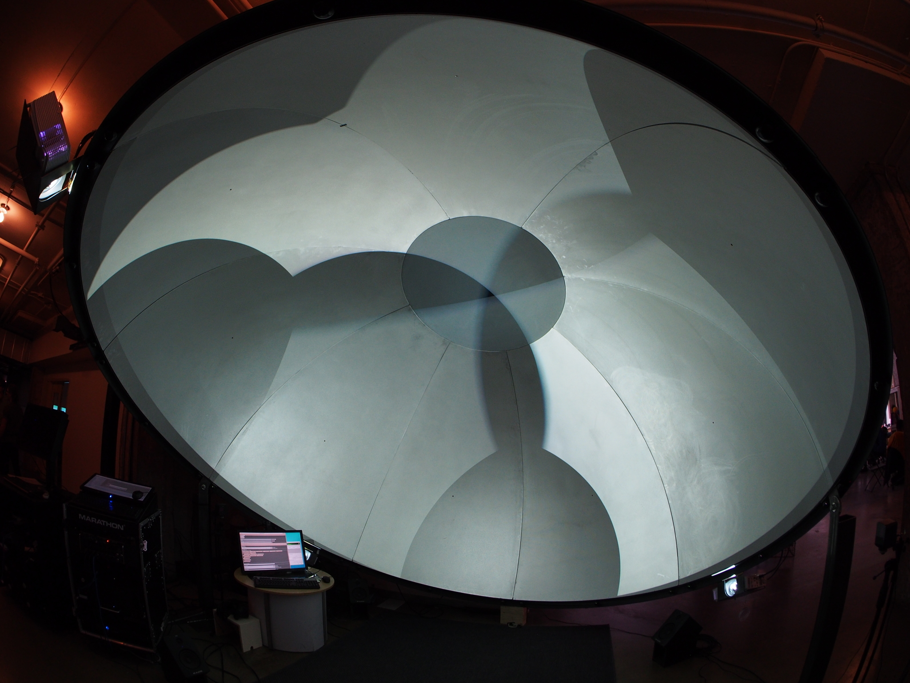

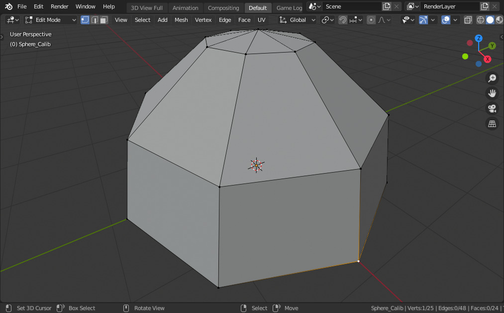

Finally, we need some texture coordinates to be able to display a pattern image and help with the calibration process. With the 3D model selected in Blender, enter Edit mode by pressing the Tab key, then press 'U' and select 'Smart UV Project'. Then exit edit mode by pressing the Tab key again.

In the next sections, this low definition 3D model will be referred to as the calibration model.

#### Create the configuration using the Blender addon
Now that we have the calibration model, we can go forward with the creation of the base configuration for Splash, inside the same Blender project. For this example, we will consider that there are three video-projectors connected to the second, third and fourth outputs of the (only) graphic card. This first output is sent to an additional display for controlling purpose. All outputs are set to 1920x1080.

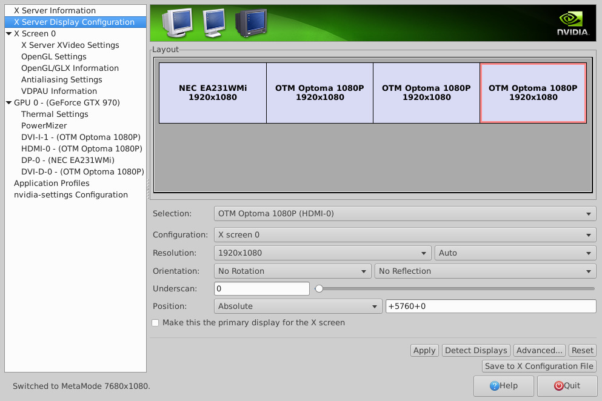

The Splash addon for blender is used to create this configuration, the final Splash tree looks like this:

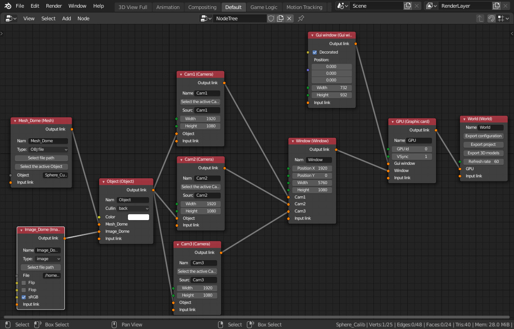

The tree must be read from right to left. The base node is the World one, to which all other nodes must be connected (directly or indirectly). A GPU node is connected to it, which represents the graphic card of the computer. If we had two graphic cards, we would have to create two of these nodes to output on all the available outputs.

The GUI window is created in a dedicated node, and will be displayed in the first monitor. There is only one other window, spanning accross all the video-projectors (hence its size of 3840x1080), and all cameras (each one corresponding to a video-projector) are connected to it. This is the advised set-up, as it leads to better performances. Overall, the fewer windows the better as it reduces the number of context switching for the graphic card.

An Object node is connected to all cameras as all video-projectors target the same projection surface. This node receives as input an Image node (which is set up to use the image located in `data/color_map.png` inside the Splash sources), and a Mesh node node which is set to use the data from the calibration model we created earlier, by typing the calibration model name in the 'Object' field of the Mesh node. Please note that the Object node has its 'Culling' parameter set to 'back', as we want to project inside the dome.

Now we can export the Splash configuration by clicking on 'Export configuration' on the World node, which will export all the nodes connected to it. Let's name the output file `configuration.json`. The calibration model will be automatically exported in the same directory as the configuration file, as its name has been entered in the Mesh node.

#### Calibrate the multiple video-projectors
Here comes the exciting part, the calibration of the video-projectors. Load the newly exported calibration filer, either by running Splash and drag&dropping the file `calibration.json`, or by launching Splash from the command line with the configuration file as a parameter:

``` bash
cd CONFIGURATION_FILE_OUTPUT_DIRECTORY
splash configuration.json
```

Two windows will appear. One is the GUI and shows up on the monitor, the other window spans accross all the video-projectors. If not, something is wrong with either the configuration in the Blender file, or with the configuration of the displays. If all is good, you should not have to interact with the second window at any time, everything is done through the GUI window.

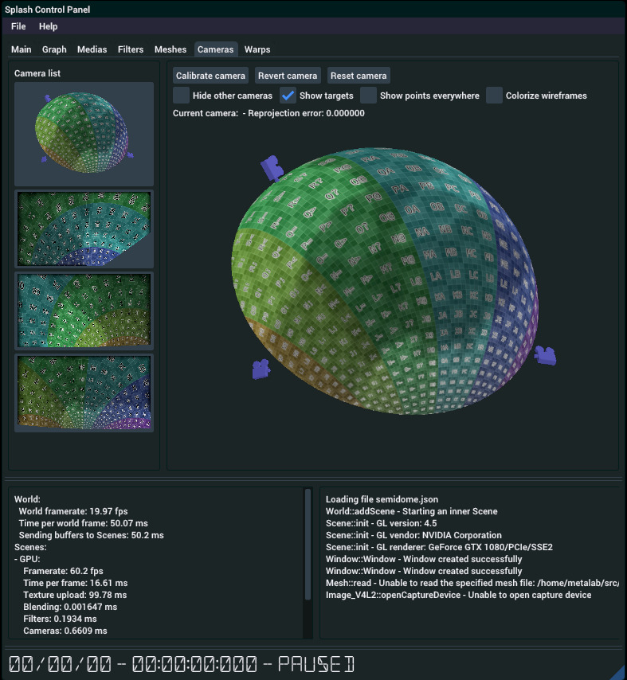

##### General information about calibration

Select the GUI window and press Ctrl+Tab: the GUI shows up! You can find additional information about the GUI in the [GUI](./Gui) page. The important tabulation for now is named 'Cameras'. Open it by clicking on it. From this tabulation you can select any of the cameras defined earlier in Blender. Note that when a camera is selected, it is highlighted by an orange seam, so as to help seeing to which video-projector this camera's output is sent. By default the first camera from the list is selected, which is kind of an overview camera and is not sent anywhere. You have to go back to selecting this camera to disable any highlighting of the other cameras.

Once you have selected a camera, you can move the point of view with the following actions:

- right click: rotates the view around
- shift + right click: pans the view
- ctrl + right click: zoom in / out

You can also hide other cameras to focus on one or two cameras with the following options:

- Hide other cameras (or H key while hovering the view): hide all cameras except the selected one
- Ctrl + left click on a camera in the list: hide / show the given camera

Now press Ctrl+W:  this switches the view to wireframe mode. Ctrl+T switches back to textured mode. While in wireframe mode, you can see the vertices which will be used for the calibration process. Before starting with the calibration of the first camera, here is the general workflow for each camera:

- select a vertex on the mesh by clicking on it,
- the selected vertex now has a small sphere surrounding it, and a cross appeared in the middle of the view,
- move the cross by left clicking in the view while holding Shift: this specifies to Splash where the selected vertex should be projected,
- the cross can be moved precisely with the arrow keys,
- repeat this for the next vertex. If you select the wrong vertex, you can delete the selection by left clicking on it while pressing Ctrl,
- a vertex can be updated by re-selecting it,
- it is possible to show all crosses by pressing A when hovering the view (or clicking on 'Show targets')

Once at least six vertices have been set this way, you can ask for Splash to calibrate the camera: click on the 'Calibrate camera' button (or press C while hovering the camera view). If the calibration is feasable, you should now see the calibrated vertices projected onto their associated cross. If the view did not change, it means that the calibration cannot be done and that no camera parameters can make all vertices match their cross.

| First projector, before calibration                | First projector, after calibration               |
|:--------------------------------------------------:|:------------------------------------------------:|
| 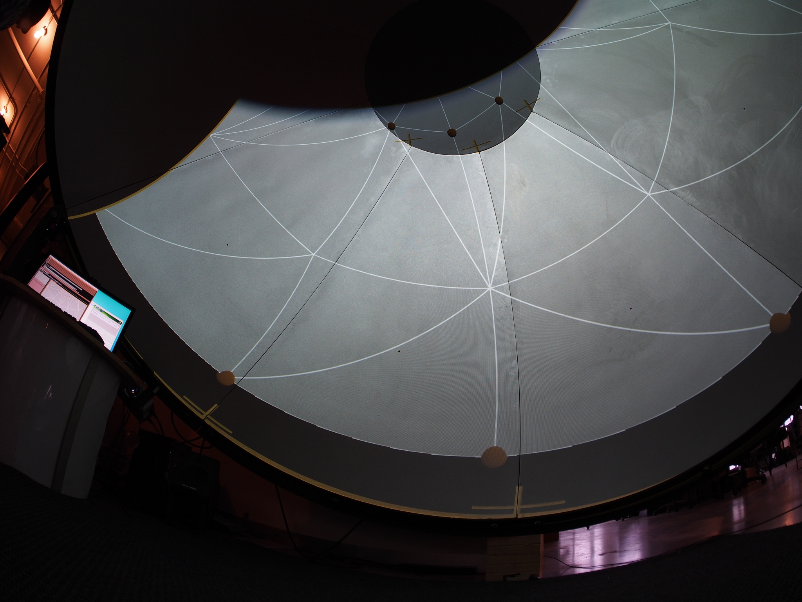 | 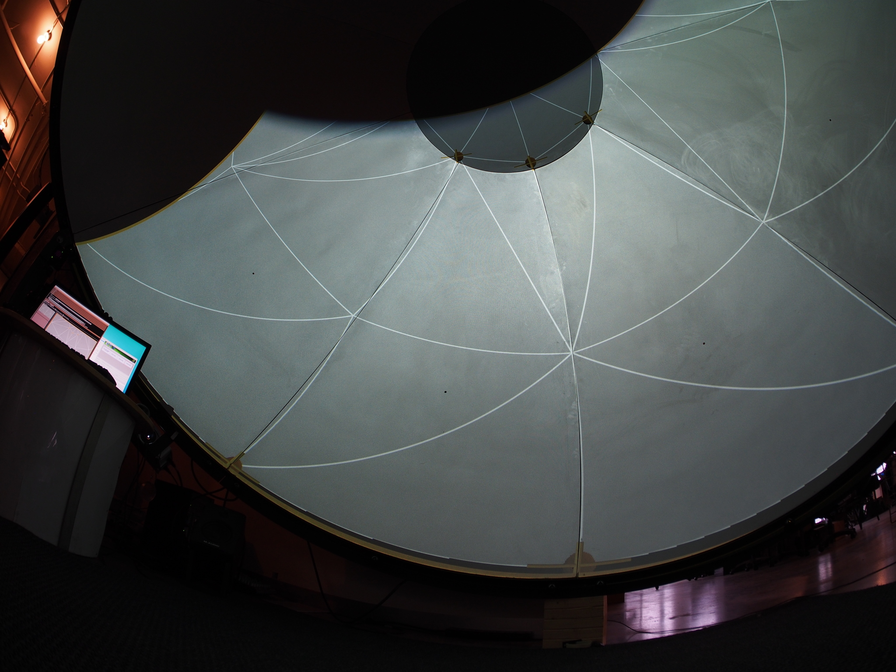 |

##### Calibration!

We are now ready to calibrate all three video-projectors. Some general thoughts to begin with: the projection surface is a dome, which means that it has quite a few symetries. This allows us to start however we want. This would obviously not be the case with a non-symetrical object, like a room for example. Having that many symetries can also be a hurdle: once the first camera has been calibrated, it is not possible to calibrate the next camera without referring to the texture. With a non-symetrical object, the 3D model should be enough.

Back to calibrating the first camera. Using the workflow described earlier, calibrate the first camera by setting at least six calibration points. It is not advised to do any fine-tuning for now: first, the 3D model used for calibration is too low resolution for any meaningful assessment of the calibration quality to be made; second, the best thing is to do a first calibration pass on all video-projectors before doing any fine-tuning.


Now for the second camera, we need to calibrate it so that its related projection matches the one of the first camera. This is where the calibration texture becomes useful. Switch to textured mode (Ctrl+T), then select in the Cameras tabulation the second camera.
To make things clearer, deactivate the third camera by Ctrl + left clicking on it in the camera list.

In the camera view, move the camera around (right click, alone or with shift or ctrl pressed), and make it match the projection of the first camera (roughly). Switch back and forth between textured and wireframe mode to determine the correspondance between both cameras. Once you found a vertex displayed by both of them, select and calibrate it. From there, go on calibrating at least 5 other points.

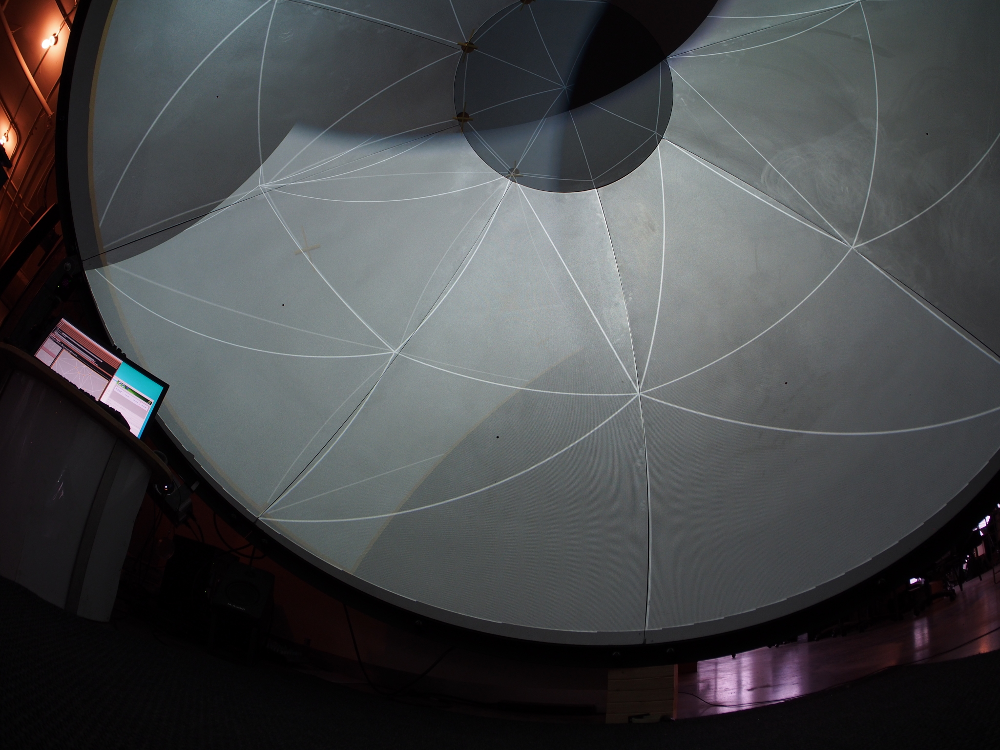

You can now go on to the third camera. Select it in the camera list: as soon as it is selected, the camera visibility is reset for all of them. Hide the second camera by Ctrl + left clicking on it, and proceed as for the second camera to calibrate it.

The first pass of calibration is finished, the next step would be to check the result, but for this we need a higher definition 3D model of our projection surface. Save the configuration by pressing Ctrl+S.

#### Create a high definition 3D model, and replace the low definition one

There are multiples ways to create a high definition 3D model of a projection surface. As we are projecting onto a dome, we only need to create a UV sphere that we will cut in half. The only prerequisite is that its diameter is precisely the same as the diameter of the calibration model. We also need to generate the texture coordinates. To make it match a spherical projection, do as follows:

- enter edit mode by pressing the Tab key,
- select all vertices (using the A key),
- press U, then chose 'Unwrap'
- exit edit mode by pressing the Tab key.

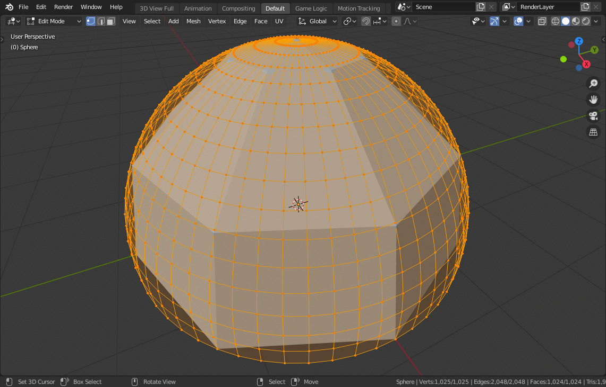

Then we need to export this 3D model. With the object selected, go to 'File > Export > Wavefront (.obj)' menu. As export parameters, set the following:

- Forward: Y forward
- Up: Z up
- Selection Only: true
- Write Materials: false

Then browse to the directory where the `configuration.json` has been exported, and finalize the export with a meaningful name (`dome_hires.obj` for instance).

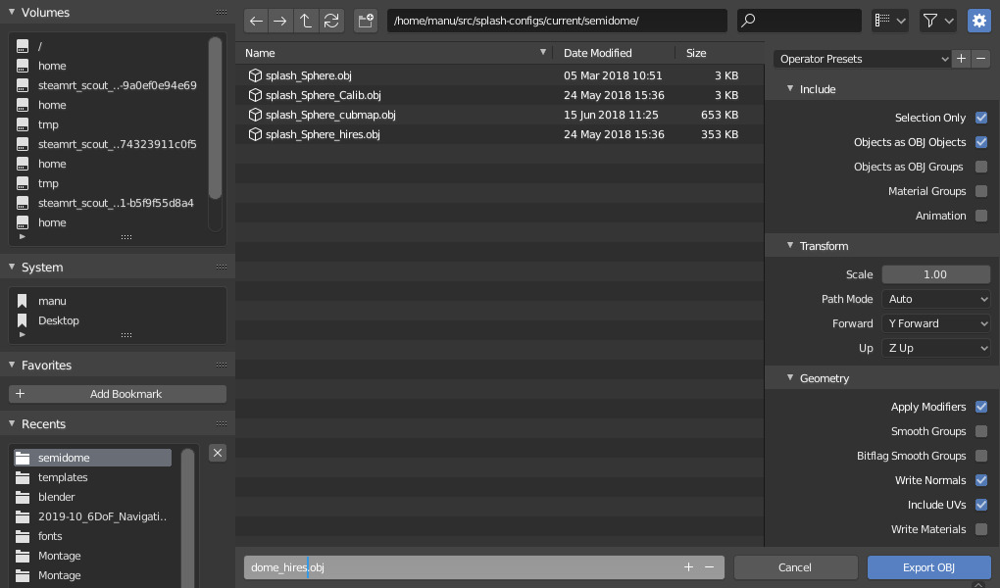

Go back to Splash. In the Meshes tabulation, open the 'mesh' object, then set the source obj file to the newly exported file (either by manually typing the path, or by selecting it with the '...' button). Save the configuration by pressing Ctrl+S.

#### Calibration, second round

We can now fine-tune the calibration. Replacing the calibration model with the high definition one should already have improved things quite a bit, but chances are that there is still some work to do. There is not much to learn here, but here are a few tricks to make the projections match a bit better:

- switch to wireframe mode, as it is easier to see the defaults in this mode.
- for each camera, select the existing points and move them. If possible, Splash will recompute the calibration automatically. If not you can force Splash to do it by pressing Ctrl+C while hovering the view.
- if some areas of a projection has no calibration point, add at least one there.
- try to keep the distance between the vertices and their associated cross as small as possible. The larger the distance, the worst the calibration is from a geometric point of view.

If you have the feeling that this is as far as you can go, this is the time to use some warping. This is usually the case with projection surfaces which are far from perfect, like inflattable domes and such. The warping abilities of Splash can be found in the Warps tabulation, and work as follows:

- select a camera: a lattice appears on it, each intersection being a point which can be moved,
- select a point of the lattice, and move it with the mouse or the arrow keys: the view is altered accordingly,
- use this to better match areas between overlapping projectors.

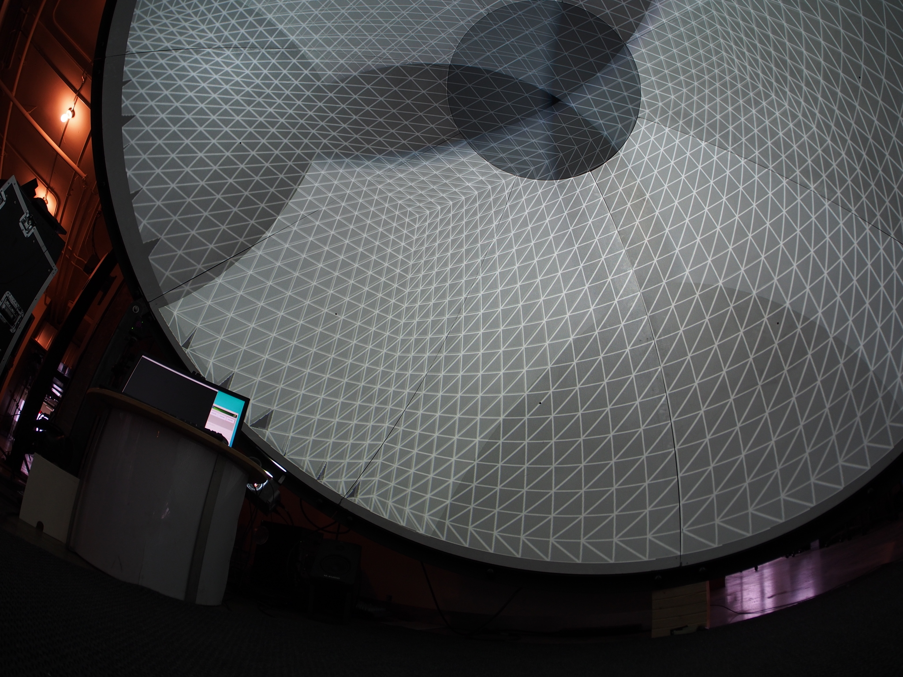

Lastly, when the calibration seems correct, we can activate the blending of the video-projectors. This is the easy part: press Ctrl+B (or click on the 'Compute blending map' button in the 'Main' tabulation). Also, don't forget to go back to textured mode with Ctrl+T.

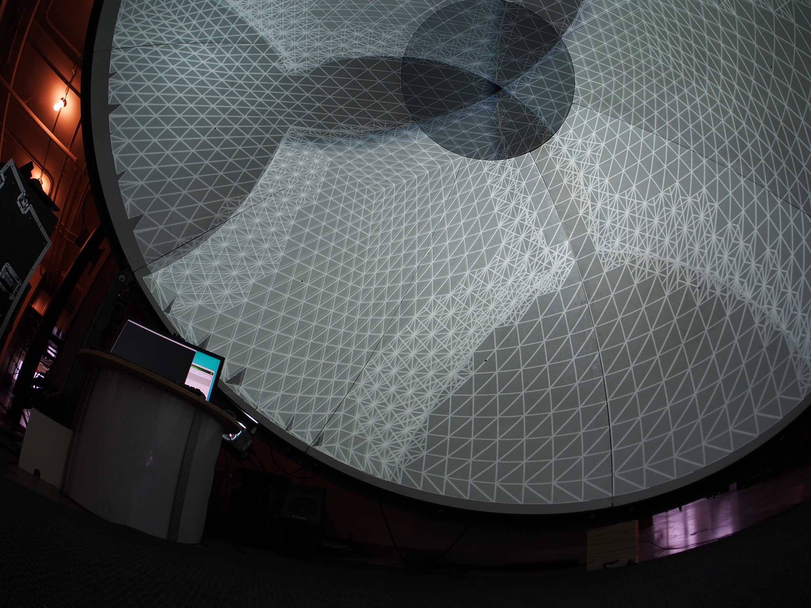

#### Load some video contents
The final step is to replace the static texture used previously with a film. Still in Splash, go to the Medias tabulation. There you have a list of the inputs of your configuration and you can modify them. Select the only object in the list, that change its type from "image" to "video". Next, update the "file" attribute with the full path to a video file.

-------------------------------------------

## Advanced usages

### Shape placement example

This example shows an alternative use of Splash, sideways from its original target usage and closer to what can be found in most single projector video-mapping softwares. The idea is to place polygons on a real object directly on the projection, which implies that there is no need to create a precise 3D model of the objets. The downside is that this approach can not handle automatic blending when using multiple projectors. The workflow is as follows:

- place the video-projector so that all the target objects are inside its cone of projection,
- export from Blender a configuration file,
- open the file in Splash,
- use Blender to create and update polygons in Splash in real-time,
- adapt the UV mapping of these polygons to match the selected video.

To do this this tutorial, you will need:
- Splash installed on a computer
- a video-projector connected to the computer
- any projection surface, really

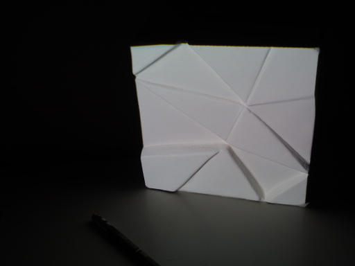

To be able to follow this guide, you need to install the shmdata addon for Blender: see [this page](../User_Interface/#blender-addons) to install it.

#### Create and export a configuration file from Blender
Let's say that placing the video-projector is up to the user, and start with the export from Blender. Our goal here is to create a very simple scene which will roughly match the real installation. Once Blender is started, you can delete the light from the default startup scene. Place the camera along the Y axis and make of look toward this same axis. You should get a scene looking like this, from a top-down view:

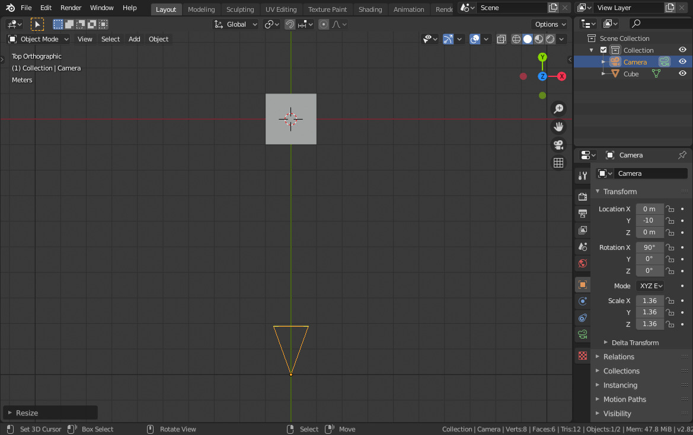

For this example to work, Blender needs to be able to send the mesh of the edited object in real-time to Splash, which in turn will update its display. This is done through the Blender Splash addon, which is able to output one or more meshes through shared memory. The setup is not as complicated as it may seem, as it is mostly a few paths to specify for the exporter to configure everything. First we will make it so Blender outputs the mesh:

- select the cube in Blender (if you deleted it from an automated behavior like I do sometimes, recreate it),
- go to the `Shmdata properties` section of the `Object properties` panel
- click on `Send mesh`.

Now we need to create the Splash configuration. We consider that the video-projector is the second screen of the computer, and that both the computer screen and the video-projector have a resolution of 1920x1080. Inside the Blender node editor, create a Splash node tree which looks as follows:

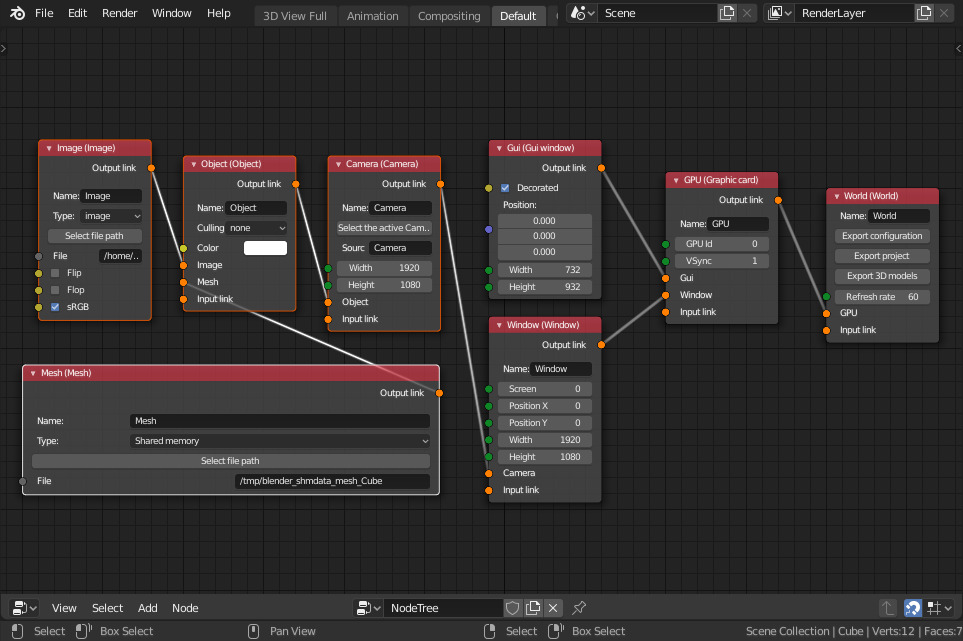

The main difference with the previous example here is that instead of setting the Mesh node to use a Blender object as a source for its data, with set its 'Type' parameter to 'Shared memory' and, through the 'Select file path' button, go find the shared memory socket which should be in '/tmp/blender_shmdata_mesh_Cube'.

Click on 'Export tree' from the World node to export all the nodes connected to it, and call the output file 'configuration.json'

#### Load the configuration in Splash
This part is really easy. Either drop the newly created configuration file on the Splash window, or load it from the command line:

``` bash
splash configuration.json
```

Two windows will appear, one borderless (and fullscreen if set correctly) and another one which will show the GUI when pressing Ctrl + Tab. The most useful command in Splash in this case it the switch from Wireframe to Textured, either using the keyboard shortcuts (Ctrl + W and Ctrl + T) or from the GUI.


#### Update the polygons and their texture coordinates from Blender
Here is the decisive moment. Back in Blender, select the cube and enter Edit mode (press Tab). From there, any modification to the mesh will show up immediately in Splash. The idea here is to place the polygons so that they match the geometry of the objects projected onto, like this:

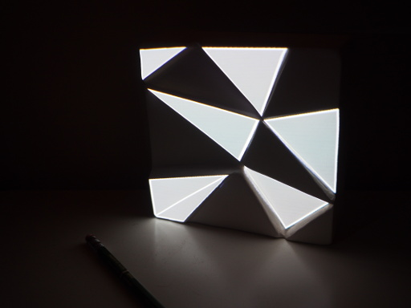

Once the polygons are in place, we have to create the texture coordinates, the easy way being by selecting all the vertices, pressing 'U' and chosing "Unwrap". The result will show up immediately in Splash, and can be tuned to better match the input video.

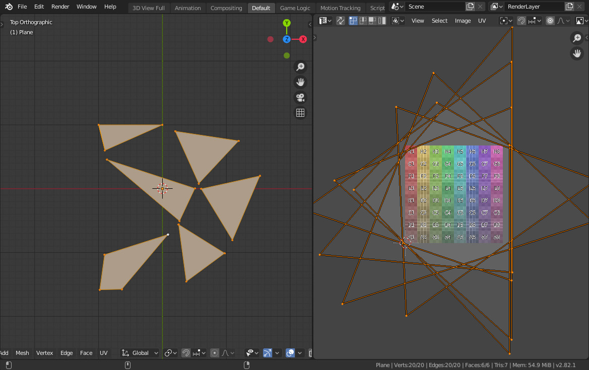

With a very simple video of concentric light circle, you can obtain something like this:

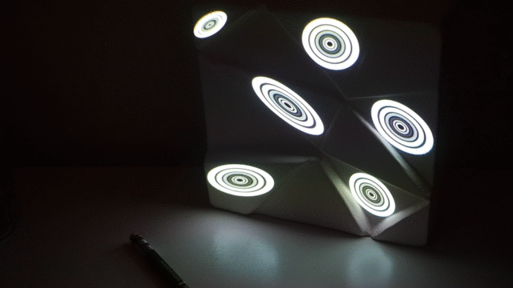

Once again, the Blender community has excellent resources regarding modeling in Blender, to help you with the creation of the polygons and even of the videos to project!

-------------------------------------------

### Virtual probe example

This example illustrates how to use a virtual probe. It supports spherical mapping and equirectangular mapping. It is a useful feature when the input source is incompatible with the projection surface. We will demonstrate, in the following example, how it can be used to create a spherical or equirectangular projection from a cubemap. Below is the cubemap image that will be displayed in the dome.

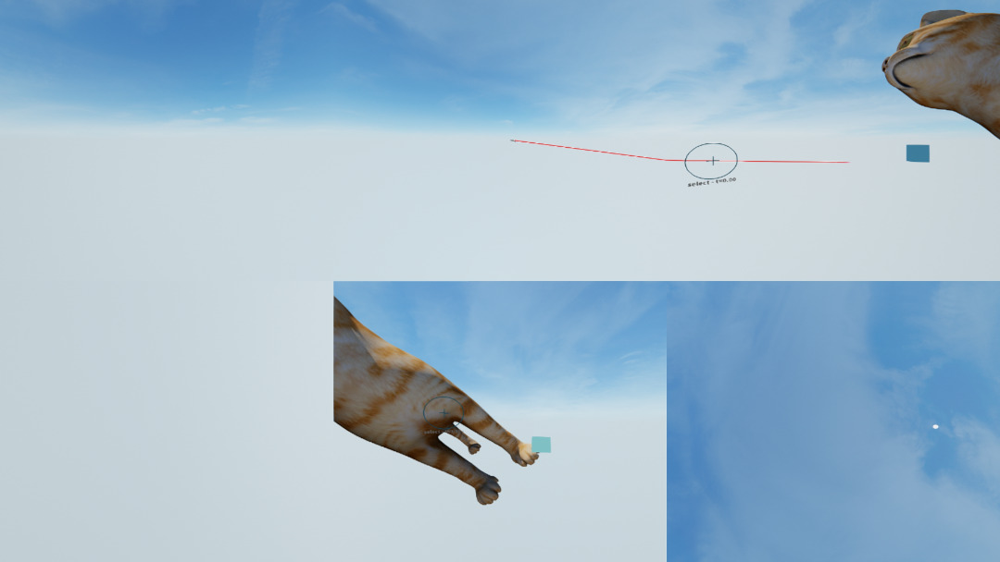

As with the previous example, the pipeline is as follows:

- create a low definition 3D model of the projection surface, used for calibration,
- export from Blender a draft configuration file,
- open the file in Splash, calibrate the video-projectors using the color-map,
- create a high definition 3D model of the projection surface, used for projection,
- replace the low definition 3D model with the high definition one,
- In the Blender configuration file, replace the Image by the probe setup
- load the cubemap image to the projection surface

Since the workflow repeats the same steps as the [multi-projector example](#multi-projector-example), this example will continue where the previous demonstration left off, that is, after loading the high definition mesh into Splash. Save this configuration with Ctrl + s.

#### Create a 3D model of the cubemap and update the Node tree
We will start from the previous Blender configuration file. The Image node is now replaced by a Probe node. An Object node is connected to the probe. This object receives as input an Image node (this image is rendered under a cubemap projection) and a Mesh node associated to a cube mesh. Below is the final node tree:

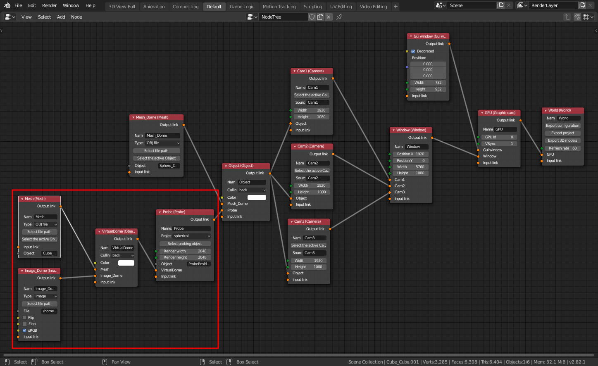

Notice that the probe projection is set to spherical and the render width and height is 2048x2048 in our case. The cubemap object node has back culling since we are "virtually" projecting inside a cube.
Attention must be taken when generating the cube uvs. The texture coordinate must be coherent with the received image cubemap. If necessary, reorder/scale Blender's "UV island".

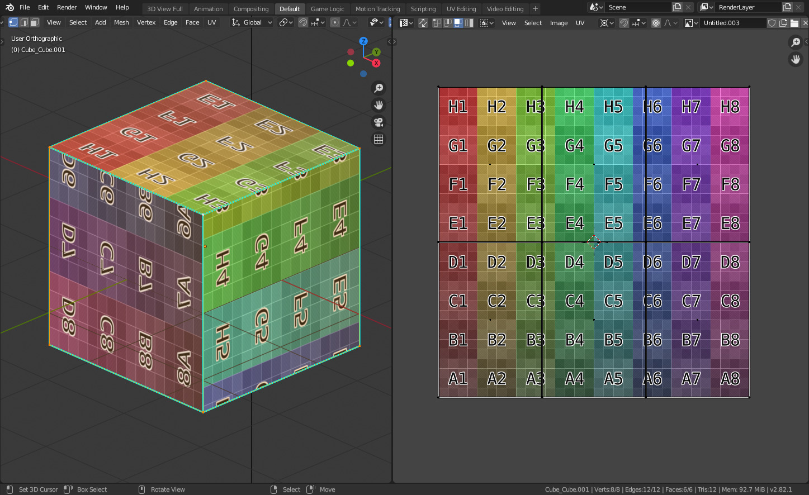

Splash configuration can be exported via the "Export configuration" button of the World node. The 3D models must be exported as well. Make sure to save this configuration file with a different name than the calibrated configuration file from the previous example.

#### Load the new configuration in Splash
Load the configuration file from the command line:

``` bash
splash probe_config.json
```

Two windows will appear, one borderless and another one which will show the GUI when pressing Ctrl + Tab. The cameras of this configuration files are not calibrated. We will copy the cameras positions and orientations from the previous example. In the File menu, select 'Copy calibration from configuration', then select the file from which to copy the configuration.

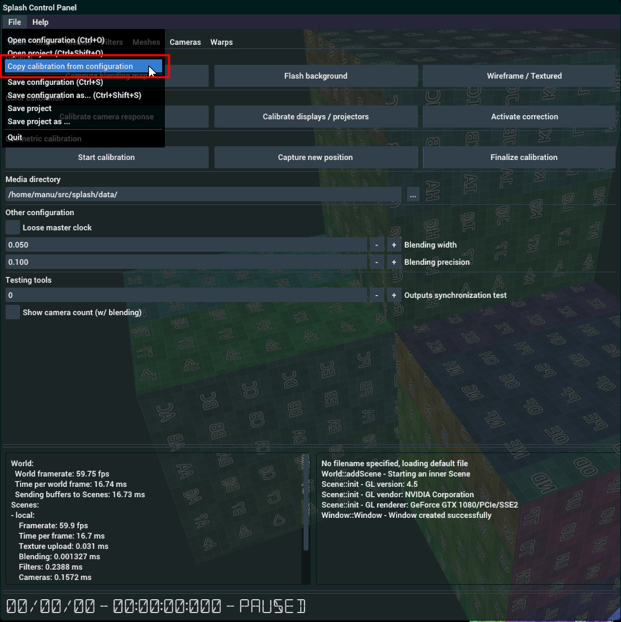

The cameras parameters, as well as the warp if any, are now transferred to the current configuration file (probe_config.json). The setup is now completed. You should see an image with spherical mapping.

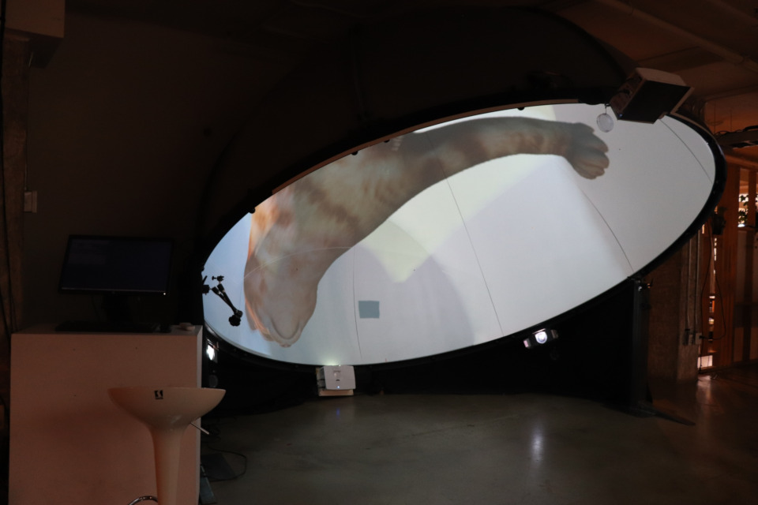

-------------------------------------------

### (Almost) automatic calibration with Calimiro

The automatic calibration is done by [Calimiro](https://gitlab.com/sat-mtl/tools/splash/calimiro). It is designed to work with different cameras, in particular with DSLR, webcams and industrial cameras. We advice to use a fast shutter speed camera with a wide field of view to make the process faster. Note that, as of now, the calibration is only partial, it is still being developped and improved.

To do this this tutorial, you will need:
- Splash installed on a computer
- a video-projector connected to the computer
- a non-planar projection surface
- a webcam

#### Prepare the configuration file
For the calibration to work, first prepare the configuration file. Please refer to the [multi-projector example](#create-the-configuration-using-the-Blender-addon) to learn how to generate the file. Pay particular attention to make sure that Splash is configured such that each physical projector is represented by an object of type "camera" in Splash configuration.

#### Configure the camera
By default, no cameras are configured to allow flexibility in the choice of the camera used for calibration. The steps to add a camera to Splash configuration are making sure its parameters are valid (resolution, focus, exposure) and connecting it to the element in charge of the geometric calibration. Let's take the example of an OpenCV compatible camera as the steps are globally identical for other types of capture devices (DSLR or V4L2 compatible cameras) :

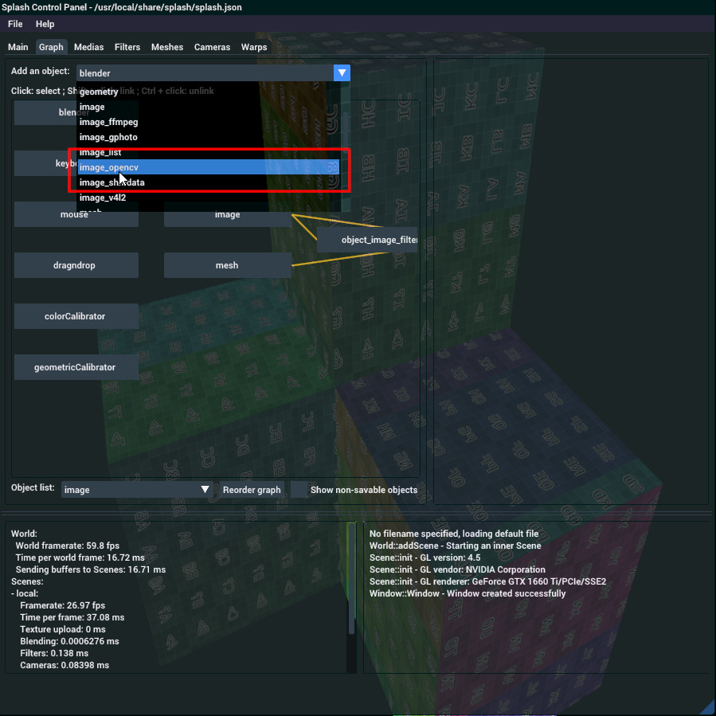

- open Splash, then reveal the interface by pressing Ctrl + tab. Feel free to enlarge the interface, it may be more comfortable
- go to the "Graph" panel
- add an object of type "image_opencv" by choosing it in the drop-down menu entitled "Add an object". This will create a new node named "image_opencv_1" in the graph. Note that it could be another source type. In fact any "external" source could work: `image_opencv`, `image_v4l2`, `image_shmdata`, `image_gphoto`
- add another node of type "filter. A node named "filter_2" will be added to the graph. It may be hidden behind a another filter. You can move the nodes around to see more clearly
- connect the object "image_opencv_1" to "filter_2". To do so, left-click on the first one, then hold down shift while left-clicking on the second one. You should see a link between the two objects
- do the same to connect the object "image_opencv_1" to the object "geometricCalibrator"
- if you feel like it, save the current configuration with Ctrl + s, it will always be one less thing to do if you make a mistake
- click on the node "image_opencv_1" from the graph to configure the camera settings. This step is quite dependent on your camera, but the minimum is to activate the camera by entering "0" in the field named "...". This will select the default camera and open the camera for capture
- you can now switch to the "Medias" panel. In this panel you will see the object "image_opencv_1", click on it
- by clicking on the field "Filter preview: filter_2", you can view the camera capture
- once the settings are correct, you can proceed to the actual calibration

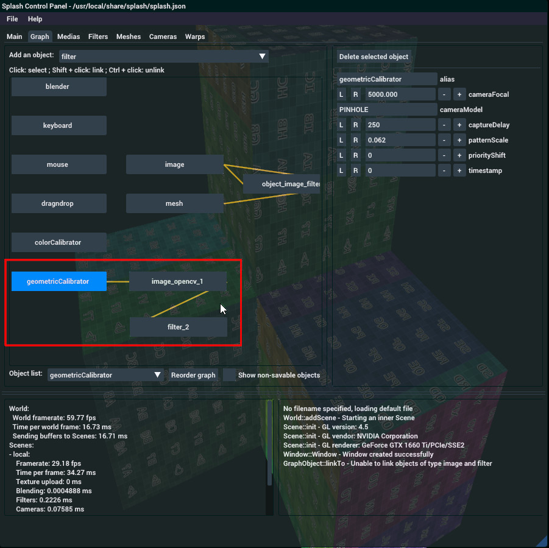

#### Calibrate
The calibration process is done from the "Main" tab in the section "Geometric calibration. The pipeline is as follow:
- start the calibration by clicking on "Start calibration". All the projectors should go black
- position the camera to the desired position
- click on "Capture new position". A sequence of structured light patterns should be displayed each projector at a time. When done, all projectors should go black again
- repeat the previous step for different positions, so that each area of the projection surface is captured at least 3 times
- finally, click on "Finalize calibration"

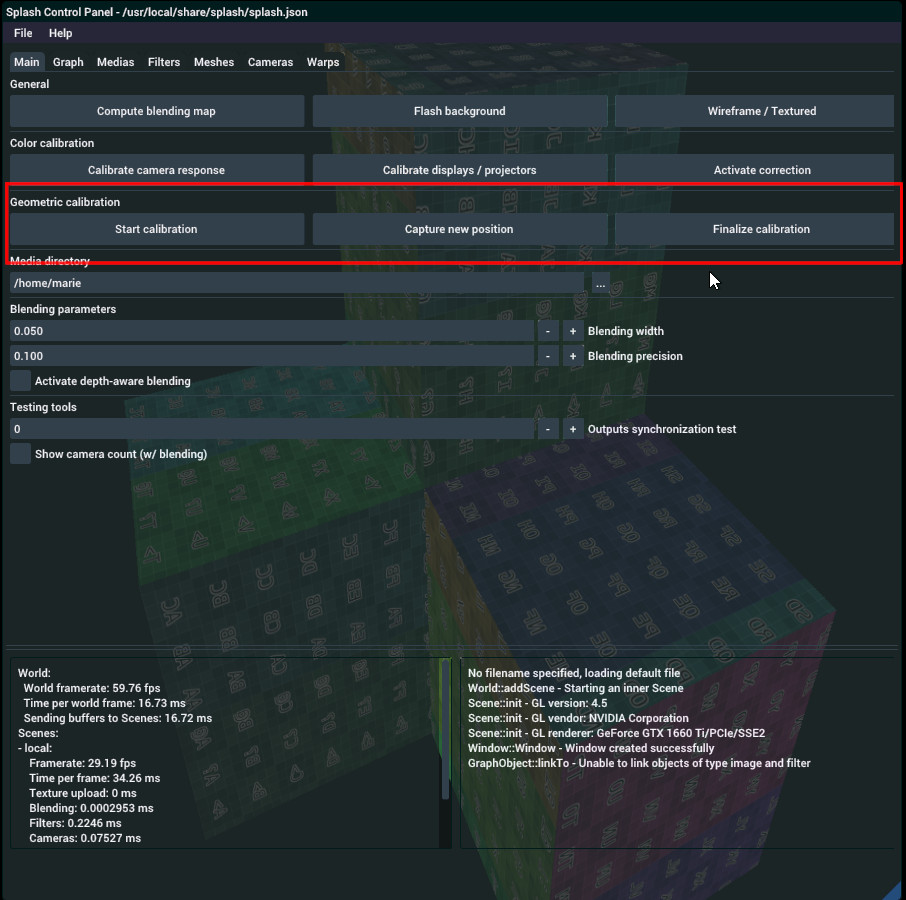

The result of the calibration process is available in the `/tmp/calimiro_$PID`directory, `$PID` being the process number of the Splash instance.
